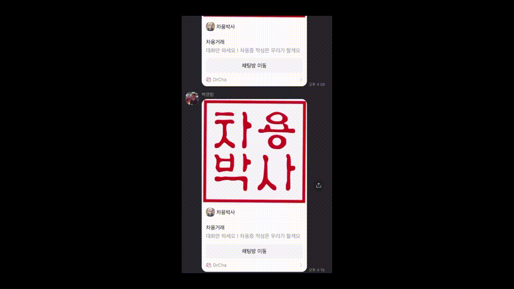
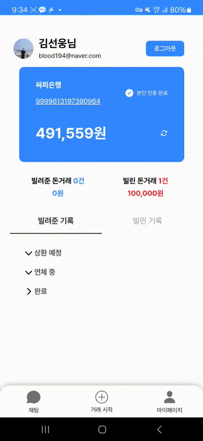
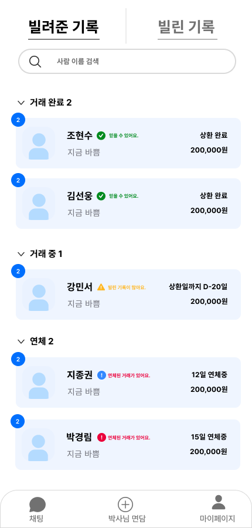
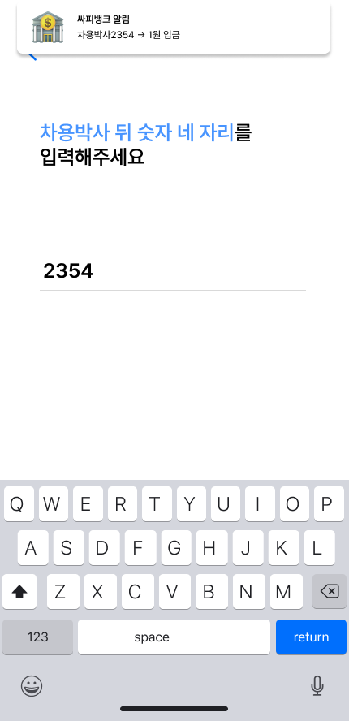

  

# 차용박사

## 📌 프로젝트 소개

차용박사는 온라인 차용증 관리와 에스크로 기반의 안전한 금전 거래를 결합한 P2P 대출 중개 서비스입니다. 신뢰성, 편의성, 투명성을 핵심 가치로 제공하여 개인 간 금전 거래의 새로운 패러다임을 제시합니다.

### 💻기간 및 인원

- 프로젝트 기간 : 2024.08.19 ~ 2024.10.11 (7주)
- 참여 인원 : 6명

### 🌟 핵심 가치

- **신뢰성**: 법적 효력이 있는 차용증과 안전한 에스크로 거래
- **편의성**: 원스톱 금전 거래 및 관리
- **투명성**: 실시간 거래 현황 및 이력 조회

## 🛠 주요 기능

### 1. 차용증 관리

- 온라인 차용증 작성 및 보관
- 1원 송금을 통한 계좌 인증 기반의 신뢰성 있는 차용증 발행
- 상환 기일 자동 알림 서비스
- 차용증 PDF 출력 기능

### 2. 거래 시스템

- 에스크로 기반 안전 거래
- 분할 상환 시스템

### 3. 실시간 채팅 기능

- 거래 당사자 간 1:1 채팅
- 채팅 내역 보관 및 검색
- 채팅 알림 설정

### 4. 거래 현황 대시보드

- 진행 중인 거래 목록 및 상세 정보 제공
- 거래 이력 조회 및 통계 기능

### 5. 알림 센터

- 상환, 독촉 알림
- 앱 내 알림 및 SNS(카카오톡) 알림 전송

## 🚀 기대 효과

1. 개인 간 금전 거래의 안전성 및 신뢰도 향상
2. 금전 거래 관련 분쟁 감소
3. 사용자 편의성 증대로 인한 P2P 대출 시장 활성화

## :computer: 화면 구성

<table>
  <tr>
    <td align="center" colspan="2"><b>시연</b></td>
  </tr>
  <tr>
    <td align="center" colspan="2">
      
    </td>
  </tr>
  <tr>
    <td align="center"><b>첫 화면</b></td>
    <td align="center"><b>거래 내역</b></td>
  </tr>
  <tr>
    <td align="center">
      
    </td>
    <td align="center">
      
    </td>
  </tr>
  <tr>
    <td align="center"><b>거래목록</b></td>
    <td align="center"><b>1원 인증</b></td>
  </tr>
  <tr>
    <td align="center">
      
    </td>
    <td align="center">
      
    </td>
  </tr>
</table>

## 🔧 기술 스택

## 👥 팀 정보

<table>
  <tr>
    <td align="center">
      <a href="https://github.com/jijongkwon">
        
         
        <b>지종권(Infra)</b>
      </a>
    </td>
    <td align="center">
      <a href="https://github.com/cjo5929">
        
         
        <b>강민서(Backend)</b>
      </a>
    </td>
    <td align="center">
      <a href="https://github.com/LineHero">
        
         
        <b>김선웅(Frontend)</b>
      </a>
    </td>
    <td align="center">
      <a href="https://github.com/g16rim">
        
         
        <b>박경림(Backend)</b>
      </a>
    </td>
    <td align="center">
      <a href="https://github.com/LEEJW1953">
        
         
        <b>이지원(Frontend)</b>
      </a>
    </td>
    <td align="center">
      <a href="https://github.com/HyunSoo730">
        
         
        <b>조현수(Backend)</b>
      </a>
    </td>
  </tr>
</table>

© 2024 차용박사. All Rights Reserved.
